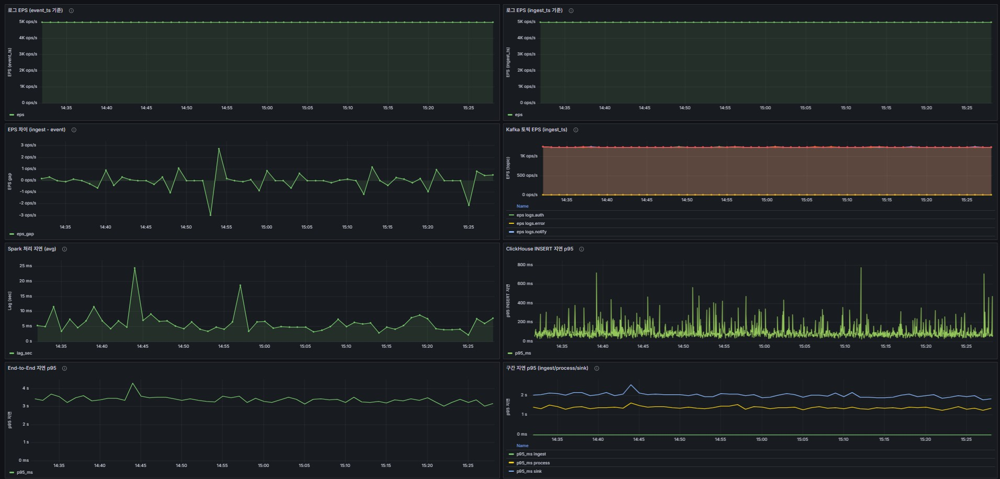

# Log ETL & Monitoring PoC Project

## 개요



대규모 로그 데이터에 대한 **수집, 처리, 모니터링**을 목표로 하는 **PoC(Proof of Concept) 프로젝트**입니다.

- 대용량 이벤트 로그를 실시간으로 수집‧가공‧시각화하는 파이프라인을 검증했습니다.
- FastAPI 기반 시뮬레이터가 Kafka 로그 토픽에 다양한 서비스 패턴을 발행하면, Spark Structured Streaming 잡이 이를 ClickHouse 분석 테이블로 적재하고 Grafana 대시보드로 노출합니다. 각 컴포넌트는 Docker Compose로 손쉽게 기동할 수 있으며, ClickHouse 초기 스키마와 Grafana 프로비저닝도 자동화되어 있어 부팅 직후부터 엔드투엔드 흐름을 검증할 수 있습니다.


## 목표

- 대규모 로그 스트림의 실시간 제약 하 안정 처리 가능성 검증.
- FastAPI → Kafka → Spark → ClickHouse → Grafana 엔드투엔드 파이프라인의 성능/지연 목표 충족 여부 확인.
- 각 단계별 병목 지점 식별 및 개선 방안 도출.
- 추가: Slack 연동 Watchdog과 Grafana 대시보드 기반 최소 운영 감시 체계 구성 및 실시간 알림/가시성 확보 가능성 검증.


## 기술 스택

| 아이콘 | 설명 |
| --- | --- |
|  | FastAPI: log_simulator 시뮬레이터 및 API 엔드포인트 |
|  | Apache Kafka + Kafka UI: 로그 수집 버퍼와 모니터링 UI |
|  | Apache Spark 4.0 Structured Streaming: Kafka → ClickHouse 실시간 적재 |
|  | ClickHouse: OLAP 테이블 로그 저장 |
|  | Grafana: ClickHouse 데이터 소스 기반 대시보드 시각화 |
|  | Docker / Docker Compose: 전체 개발 환경 오케스트레이션 |
|  | Python 3.10: 시뮬레이터, Watchdog 스크립트 등 보조 유틸 |
|  | Linux (Ubuntu 기반): VM 환경 및 파일 시스템 레이아웃 |
|  | Slack Webhook: Watchdog 알림 채널 연동 |


## 시스템 아키텍처


1. **로그 생성/수집**
   - `log_simulator/pipeline_builder.py`가 서비스별 트래픽 믹스·시간대 가중치·오류율을 반영한 HTTP 이벤트 생성 파이프라인을 구성.
   - FastAPI 앱의 `/ping` 헬스체크와 엔진 라이프사이클에 따라 지속 로그 생성.
2. **로그 브로커/버퍼링**
   - Kafka 단일 노드가 `logs.auth`, `logs.order`, `logs.payment`, `logs.notify`, `logs.error` 토픽에서 생산자와 소비자 사이 메시지 큐 역할 수행.
   - Kafka UI를 통한 토픽/파티션 상태와 소비량 확인, 필요 시 수동 토픽 관리(생성/삭제) 수행.
3. **로그 실시간 처리**
   - `spark_job/main.py`가 Structured Streaming으로 `logs.*` 패턴 구독, `fact_event.parse_fact_event()`로 스키마 정규화 수행.
   - Spark 스트림의 `/data/log-etlm/spark_checkpoints` 체크포인트 활용, 장애 복구 시점 유지.
4. **로그 저장**
   - `spark_job/warehouse/writer/fact_writer.py` → `spark_job/warehouse/sink.py`의 `write_to_clickhouse()`가 ClickHouse `analytics.fact_event` 테이블에 JDBC append 수행.
   - 초기 스키마는 `spark_job/warehouse/sql/*.sql`로 자동 생성, `/data/log-etlm/clickhouse` 볼륨 영속화.
5. **로그 시각화 및 모니터링**
   - Grafana는 프로비저닝된 ClickHouse 데이터 소스로 EPS, 오류율, 상태 코드 분포 시각화.
   - `monitor/docker_watchdog.py`는 Kafka/Spark/ClickHouse/Grafana 컨테이너 이벤트와 로그를 감시해 OOM, StreamingQueryException, health 변화 등을 Slack Webhook/CLI로 통지.


## 실행 방법

```bash
# 0. 사전 준비 단계
# - Docker / Docker Compose 설치
# - VM 환경: /data 파티션 마운트 및 디렉터리 생성, rw 권한 부여
#     sudo mkdir -p /data/log-etlm/kafka-logs /data/log-etlm/kafka-meta \
#                  /data/log-etlm/spark_checkpoints /data/log-etlm/clickhouse \
#                  /data/log-etlm/clickhouse-logs /data/log-etlm/grafana
#     sudo chown -R $USER:$USER /data/log-etlm
# - 방화벽/보안 그룹에서 29092(Kafka), 4040(Spark UI), 3000(Grafana) 허용

# 1. Kafka + Kafka UI 우선 기동
docker compose up -d kafka kafka-ui

# 2. Spark, ClickHouse, Grafana 파이프라인 기동
docker compose up -d spark clickhouse grafana

# 3. 로그 시뮬레이터 기동
docker compose up -d simulator simulator2

# 4. 상태 점검
docker compose ps
curl http://localhost:8000/ping                 # log_simulator FastAPI
curl http://localhost:4040/api/v1/applications  # Spark UI REST

# 5. (선택) CLI 모니터링
python monitor/docker_watchdog.py

# 6. (선택) Spark 프로파일 자동 전환 크론 등록
#   - ClickHouse 지연 p95 기반 Spark 프로파일 주기 조정
#   - 로그 저장 위치: logs/autoswitch.log
crontab -e
*/10 * * * * /home/kang/log-etlm/scripts/autoswitch_spark_env.sh >> /home/kang/log-etlm/logs/autoswitch.log 2>&1
```

## 프로파일 & 튜닝 포인트

- 시뮬레이터 부하 프로파일: `log_simulator/profiles/baseline.yaml`
  - `eps`, `mix`, `error_rate`, `time_weights` 등 부하 패턴 조정
- Spark 환경 프로파일: `env/{low,mid,high}.env.example`
  - `SPARK_MAX_OFFSETS_PER_TRIGGER`, `SPARK_CLICKHOUSE_WRITE_PARTITIONS`, `SPARK_CLICKHOUSE_JDBC_BATCHSIZE` 값 조정
- 유틸 스크립트 목록
  - `scripts/apply_spark_env.sh`: 프로파일 적용 후 Spark 컨테이너 재기동
  - `scripts/current_spark_env.sh`: 현재 적용된 Spark 프로파일 확인
  - `scripts/autoswitch_spark_env.sh`: ClickHouse 지연 p95 기반 자동 전환(크론 사용 가능)


## 지표 해석(요약)

- ingest: `event_ts → ingest_ts` (수집 지연)
- process: `ingest_ts → processed_ts` (Spark 처리 지연)
- sink: `processed_ts → stored_ts` (Spark → ClickHouse 적재 지연)
- end-to-end: `event_ts → stored_ts` (전체 지연)


## 결과 기록

| 시나리오 | EPS | Spark 프로파일 | E2E p95 | process p95 | sink p95 | 비고 |
| --- | --- | --- | --- | --- | --- | --- |
| baseline | 5k | mid | ~3.3s | ~1.3s | ~2.0s | EPS 약 5k, CH insert p95 약 0.1-0.3s, 스파이크 0.8s 미만 |
