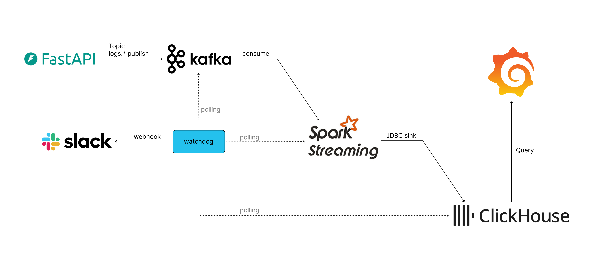

# Log ETL & Monitoring PoC Project

## 개요


대규모 로그 데이터에 대한 **수집, 처리, 모니터링**을 목표로 하는 **PoC(Proof of Concept) 프로젝트**입니다.

- 대용량 이벤트 로그를 실시간으로 수집‧가공‧시각화하는 파이프라인을 검증했습니다.
- FastAPI 기반 시뮬레이터가 Kafka 로그 토픽에 다양한 서비스 패턴을 발행하면, Spark Structured Streaming 잡이 이를 ClickHouse 분석 테이블로 적재하고 Grafana 대시보드로 노출합니다. 각 컴포넌트는 Docker Compose로 손쉽게 기동할 수 있으며, ClickHouse 초기 스키마와 Grafana 프로비저닝도 자동화되어 있어 부팅 직후부터 엔드투엔드 흐름을 검증할 수 있습니다.
- **데이터 모델**: ClickHouse의 컬럼 스토어 특성을 활용한 **Wide Table + Materialized View 서빙 모델**. `event_log`에 모든 속성을 비정규화 저장하고, MV가 INSERT 시 집계 테이블을 자동 갱신하며, Grafana는 집계 테이블만 쿼리한다. Dimension 테이블과 배치 갱신 잡은 사용하지 않는다.


## 목표 및 결과

| 목표 | 결과 |
|------|------|
| ~~real-time(실시간)~~ → **near-real-time(준실시간)** 안정적 지속 처리 | 단일 VM 환경의 자원 제약으로 real-time 불가 확인, near-real-time으로 목표 조정. 입력량 제어 정책 수립으로 **~5,000 EPS** 지속 처리, E2E 지연 **p95 ~10초** 수준 안정화 |
| FastAPI → Kafka → Spark → ClickHouse → Grafana 엔드투엔드 파이프라인 지연/처리량 목표 충족 | 각 단계별 p95 임계값(60초) 이내 유지 확인. 적재 실패 원인을 집계 경로의 메모리 피크로 식별하고 ClickHouse·Spark 튜닝으로 안정화. 중복 제거 및 재처리 보호 체계로 데이터 무결성 확보 |
| Grafana + Slack 연동 Watchdog 기반 최소 운영 감시 체계 구성 | 컨테이너 이벤트·로그 감시와 주기적 상태 점검으로 장애 조기 감지. Grafana 운영/실시간 대시보드로 EPS·지연·오류율·DLQ 가시성 확보 |


## 시스템 아키텍처



1. **로그 생성/수집**
   - `log_simulator/engine.py`가 `log_simulator/config/profiles.yml`, `log_simulator/config/routes.yml`을 읽어 서비스별 시뮬레이터/퍼블리셔 파이프라인을 구성.
   - FastAPI 앱(`log_simulator/main.py`)의 lifespan에서 엔진을 시작/중지하며 로그를 생성.
2. **로그 브로커/버퍼링**
   - Kafka 단일 노드가 `logs.auth`, `logs.order`, `logs.payment`, `logs.dlq`, `logs.error`, `logs.unknown` 토픽에서 생산자와 소비자 사이 메시지 큐 역할 수행.
   - Kafka UI를 통한 토픽/파티션 상태와 소비량 확인, 필요 시 수동 토픽 관리(생성/삭제) 수행.
3. **로그 실시간 처리**
   - Spark Structured Streaming이 fact/DLQ 스트림을 분리 구독해 정규화·중복 제거 후 적재.
   - `event_id` 기준 워터마크 dedup으로 중복 이벤트를 제거하며, 체크포인트로 장애 복구 시점을 유지.
4. **로그 저장**
   - `spark_job/fact/writers/fact_writer.py`, `spark_job/dlq/writers/dlq_writer.py`가 ClickHouse `analytics.event_log`, `analytics.event_log_dlq` 테이블에 스트리밍 적재.
   - 초기 스키마는 `infra/clickhouse/sql/*.sql`로 자동 생성, `/data/log-etlm/clickhouse` 볼륨 영속화.
   - 기존 ClickHouse 데이터 볼륨을 재사용하는 환경이면 `analytics.stream_batch_guard`가 자동 생성되지 않을 수 있으므로, 필요 시 `infra/clickhouse/sql/10_fact.sql`의 DDL을 1회 수동 적용한다.
5. **로그 시각화 및 모니터링**
   - Grafana는 프로비저닝된 ClickHouse 데이터 소스로 EPS, 오류율, 지연 등을 시각화.
   - 대시보드 JSON:
     - `infra/grafana/dashboards/ops_monitoring.json` (운영/1m 집계)
     - `infra/grafana/dashboards/realtime.json` (실시간/10s 집계)
   - 실시간 대시보드는 10초 집계 테이블을 사용한다.
     - 부하가 크면 **10s MV를 DETACH해서 비활성화**할 수 있다.
   - 기본 refresh: ops 1m / realtime 30s.
   - 운영 대시보드는 Freshness, Kafka→Spark ingest 지연, Spark 처리/ClickHouse INSERT/Grafana 쿼리 p95, **생성 대비 적재 비율(1m)** 등의 운영 지표가 포함된다.
   - `infra/monitor/main.py`는 Kafka/Spark/ClickHouse/Grafana 컨테이너 이벤트와 로그를 감시해 OOM, StreamingQueryException, health 변화 등을 Slack Webhook/CLI로 통지한다.
     - `ALERT_BREACH_GRACE_SEC`로 지연 스파이크가 일정 시간 이상 지속될 때만 알림을 보낼 수 있다.


## 기술 스택

| 아이콘 | 설명 |
| --- | --- |
|  | Python 3.10: 시뮬레이터, Watchdog 스크립트 등 보조 유틸 |
|  | FastAPI: log_simulator 시뮬레이터 및 API 엔드포인트 |
|  | Apache Kafka + Kafka UI: 로그 수집 버퍼와 모니터링 UI |
|  | Apache Spark 4.0 Structured Streaming: Kafka → ClickHouse 실시간 적재 |
|  | ClickHouse: OLAP 테이블 로그 저장 |
|  | Grafana: ClickHouse 데이터 소스 기반 대시보드 시각화 |
|  | Docker / Docker Compose: 전체 개발 환경 오케스트레이션 |
|  | Linux (Ubuntu 기반): VM 환경 및 파일 시스템 레이아웃 |
|  | Slack Webhook: Watchdog 알림 채널 연동 |


## 실험 환경 / 제약 및 결정

- **환경** : VirtualBox Ubuntu 단일 VM에서 Simulator, Kafka, Spark(Structured Streaming), ClickHouse, Grafana를 Docker Compose로 동시 구동
- **리소스 변경 과정**:
  - vCPU 4로 시작 → Spark 처리(워커/코어) 병목 확인 후 증설
  - vCPU 6까지 증설해도 CPU 포화가 지속(컴포넌트 간 CPU 경합)
  - vCPU 8은 VM 강제 종료 문제로 운영 불가 
  - **vCPU 7도 포화 상태이지만 그나마 안정 구동 확인**
  - **관찰 결과**: 단일 VM에서 여러 컴포넌트가 CPU를 경쟁적으로 점유하여 “초저지연 실시간(수 초)” 목표는 비현실적임을 확인
  - **결정**: 안정적인 지속 처리를 우선하여 **약 10초 수준의 지연을 허용하는 near-real-time** 목표로 조정  


## 실행 방법

```bash
# 0. 사전 준비 단계
# - .env 파일 생성 (최초 1회)
#     cp .env.example .env
#     # .env를 열어 각 값을 실제 패스워드로 교체
# - Docker / Docker Compose 설치
# - VM 환경: /data 파티션 마운트 및 디렉터리 생성, rw 권한 부여
#     sudo mkdir -p /data/log-etlm/kafka-logs /data/log-etlm/kafka-meta \
#                  /data/log-etlm/spark_checkpoints /data/log-etlm/spark-events \
#                  /data/log-etlm/clickhouse /data/log-etlm/clickhouse-logs \
#                  /data/log-etlm/grafana
#     sudo chown -R $USER:$USER /data/log-etlm
# - 방화벽/보안 그룹에서 29092(Kafka), 4040(Spark UI), 3000(Grafana) 허용
#   (선택) 8000(simulator), 8080(kafka-ui), 8081/8082(Spark master UI), 5521(ch-ui)
# - ClickHouse(8123/9000)는 기본적으로 localhost 바인딩(외부 접근 필요 시 docker-compose.yml 포트 수정)

# 1. Kafka + Kafka UI 우선 기동
docker compose up -d kafka kafka-ui

# 2. ClickHouse 기동
docker compose up -d clickhouse ch-ui

# 3. Spark 기동
docker compose up -d spark-master spark-worker-1 spark-worker-2

# 3-1. Spark-driver 기동 (Kafka/ClickHouse healthcheck 이후 권장)
docker compose up -d spark-driver

# 4. Grafana 기동
docker compose up -d grafana
# - grafana-clickhouse-datasource 플러그인 필요(온라인이면 GF_INSTALL_PLUGINS 사용)

# 5. 로그 시뮬레이터 기동 (Spark-driver 정상 기동 후)
docker compose up -d simulator

# 6. (선택) CLI 모니터링
python infra/monitor/main.py

# 7. (선택) Spark 프로파일 자동 전환 크론 등록
#   - ClickHouse 지연 p95 기반 Spark 프로파일 주기 조정
#   - 로그 저장 위치: logs/autoswitch.log
crontab -e
*/10 * * * * /home/kang/log-etlm/scripts/autoswitch_spark_env.sh >> /home/kang/log-etlm/logs/autoswitch.log 2>&1
```


## Kafka 토픽 파티션 분배(도메인 기준)

`KAFKA_AUTO_CREATE_TOPICS_ENABLE=true`여도 기본 파티션은 1개이므로,
초기 한 번은 명시적으로 생성하고 이후 `--alter --partitions N`으로 증설한다.

파티션 수는 트래픽 비중(auth 50% / order 30% / payment 20%)과 Spark worker 코어(총 5)를 기준으로
`PRE_COALESCE_PARTITIONS=3`, `SHUFFLE_PARTITIONS=3`, `WRITE_PARTITIONS=3`에 맞춰 결정한다.
합계 7파티션 → pre_coalesce(7→3) → dropDuplicates 셔플(3→3, no-op) → JDBC write(3커넥션).

| 토픽 | 파티션 | 근거 |
|------|--------|------|
| `logs.auth` | 3 | 50% 트래픽 |
| `logs.order` | 2 | 30% 트래픽 |
| `logs.payment` | 1 | 20% 트래픽 |
| `logs.error` | 1 | 극소량 |

```bash
# 생성 예시(자동 생성이 켜져 있어도 명시적으로 1회)
docker exec -it kafka kafka-topics --bootstrap-server kafka:9092 --create --if-not-exists --topic logs.auth --partitions 3 --replication-factor 1
docker exec -it kafka kafka-topics --bootstrap-server kafka:9092 --create --if-not-exists --topic logs.order --partitions 2 --replication-factor 1
docker exec -it kafka kafka-topics --bootstrap-server kafka:9092 --create --if-not-exists --topic logs.payment --partitions 1 --replication-factor 1
docker exec -it kafka kafka-topics --bootstrap-server kafka:9092 --create --if-not-exists --topic logs.error --partitions 1 --replication-factor 1

# 증설 예시(줄이기 불가)
docker exec -it kafka kafka-topics --bootstrap-server kafka:9092 --alter --topic logs.auth --partitions 3
docker exec -it kafka kafka-topics --bootstrap-server kafka:9092 --alter --topic logs.order --partitions 2

# 확인
docker exec -it kafka kafka-topics --bootstrap-server kafka:9092 --describe --topic logs.auth
```

> 파티션 감소는 불가하므로 필요 시 토픽 삭제 후 재생성한다.


## 프로파일 & 튜닝 포인트

### 시뮬레이터
- 부하 프로파일/라우트 설정은 `log_simulator/config/{profiles.yml,routes.yml}` 참고
- 런타임 설정: `docker-compose.yml`의 simulator environment
  - `TARGET_INTERVAL_SEC`, `LOG_BATCH_SIZE`, `LOOPS_PER_SERVICE`, `PUBLISHER_WORKERS`
  - `SIMULATOR_SHARE`, `SIM_BEHIND_LOG_EVERY_SEC`

### Spark 스트리밍

- 환경 프로파일 값은 `config/env/{low,mid,high}.env` 참고(적용은 `docker-compose.yml`)
- 스트림 분리/동작: `docker-compose.yml`
  - `SPARK_FACT_TOPICS`, `SPARK_DLQ_TOPIC`, `SPARK_ENABLE_DLQ_STREAM`, `SPARK_STARTING_OFFSETS`, `SPARK_STORE_RAW_JSON`
  - `SPARK_FACT_TRIGGER_INTERVAL`, `SPARK_RESET_CHECKPOINT_ON_START` (기본 `false`)
  - `SPARK_STREAM_SHUFFLE_PARTITIONS`, `SPARK_SKIP_EMPTY_BATCH`
  - `SPARK_BATCH_TIMING_LOG_PATH`, `SPARK_PROGRESS_LOG_PATH`

### ClickHouse
- 적재 튜닝: `SPARK_CLICKHOUSE_WRITE_PARTITIONS`, `SPARK_CLICKHOUSE_JDBC_BATCHSIZE`
- 배치 가드(중복 배치 skip): `SPARK_CLICKHOUSE_BATCH_GUARD_ENABLED`, `SPARK_CLICKHOUSE_BATCH_GUARD_TABLE`
  - `wait_for_async_insert=0` 설정으로 인해 배치 가드는 "버퍼 수신 완료" 기준으로 기록된다. throughput 우선 설계 선택이며, flush 직전 재시작 시 유실 위험이 있음을 인지하고 수용한다.
- 읽기/리파티션: `SPARK_CLICKHOUSE_JDBC_FETCHSIZE`, `SPARK_CLICKHOUSE_ALLOW_REPARTITION`
- 서버/사용자 설정: `infra/clickhouse/`
  - `config.d/` (예: listen_host, async insert 로그)
  - `users.d/` (예: log_user async_insert, `wait_for_async_insert=0`)

### Kafka
- 보관/메모리: `KAFKA_HEAP_OPTS`, `KAFKA_LOG_RETENTION_HOURS`, `KAFKA_LOG_RETENTION_BYTES`, `KAFKA_LOG_SEGMENT_BYTES`, `KAFKA_NUM_PARTITIONS`

### near-real-time 운용 팁(단일 VM 기준)
- CPU 포화 시 `SPARK_FACT_TRIGGER_INTERVAL`과 `SPARK_MAX_OFFSETS_PER_TRIGGER`를 조정해 지연(SLA)을 안정적으로 맞추는 것을 우선한다.
- 실시간(10s) 집계가 과부하를 유발하면 10s MV를 DETACH해 운영(1m) 지표 중심으로 관찰한다.

### 유틸 스크립트 목록
- Spark 프로파일: `scripts/apply_spark_env.sh`, `scripts/current_spark_env.sh`, `scripts/autoswitch_spark_env.sh`
- Kafka/Spark 지연: `scripts/check_backlog.sh`, `scripts/kafka_spark_lag.py`
- ClickHouse 진단: `scripts/clickhouse_diagnostics.sh`, `scripts/diag_partition_and_partlog.sh`
- 스파이크 분석: `scripts/publish_spike_diag.sh`


## 지표 해석(요약)
- ingest: `event_ts → ingest_ts` (수집 지연)
- process: `ingest_ts → processed_ts` (Spark 처리 지연)
- sink: `processed_ts → stored_ts` (Spark → ClickHouse 적재 지연)
- end-to-end(ops): `ingest_ts → stored_ts` (전체 지연)
- 생성 대비 적재 비율: `created_ts` 대비 `stored_ts` 비율 (1분 버킷 기준, 지연이 크면 0%로 보일 수 있음)
- DLQ: `analytics.event_log_dlq_agg_1m` (service, error_type, total)


