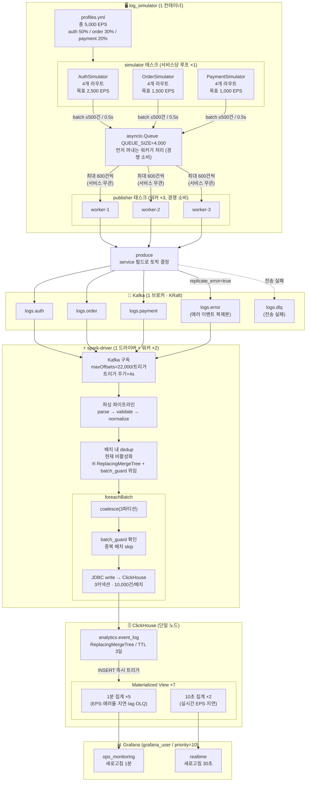

# E2E 파이프라인 흐름

이벤트 로그가 생성되어 Grafana 대시보드에 표시되기까지의 전체 흐름을 단계별로 기술한다.
코드의 실제 동작을 기반으로 작성했으며, 핵심 설계 의도와 주의사항도 함께 담았다.

---

## 전체 구조



각 단계는 독립적인 프로세스(컨테이너)로 동작하며 Kafka를 경계로 느슨하게 결합되어 있다.
Simulator가 다운되어도 Spark는 Kafka에 남은 메시지를 계속 소비할 수 있고,
Spark가 재시작되어도 Simulator는 계속 발행할 수 있다.

---

## 1단계: 이벤트 생성 (log_simulator)

### 개요

3개 서비스(auth / order / payment)가 각각 독립적인 시뮬레이터 인스턴스로 동작하며,
설정된 EPS 비율에 따라 이벤트를 생성해 공유 큐(`publish_queue`)에 넣는다.

```
profiles.yml (5,000 EPS, mix 50/30/20)
        │
        ▼
┌───────────────────────────────────────────────────────┐
│                    SimulatorEngine                    │
│                                                       │
│  ┌─────────────────────────────────────────────────┐  │
│  │              simulator 태스크 그룹               │  │
│  │                                                 │  │
│  │  AuthSimulator  ──→  루프 ×1  (2,500 EPS 목표)  │  │
│  │  OrderSimulator ──→  루프 ×1  (1,500 EPS 목표)  │  │
│  │  PaymentSimulator→  루프 ×1  (1,000 EPS 목표)  │  │
│  │                                                 │  │
│  │  [루프마다] 토큰 버킷으로 batch_size 결정        │  │
│  │           → asyncio.to_thread(이벤트 생성)      │  │
│  │           → publish_queue.put(batch)            │  │
│  └─────────────────────────────────────────────────┘  │
│                          │                            │
│                  asyncio.Queue(4,000)                 │
│                          │                            │
│  ┌─────────────────────────────────────────────────┐  │
│  │             publisher 태스크 그룹                │  │
│  │                                                 │  │
│  │  worker-1  worker-2  worker-3  (PUBLISHER_WORKERS=3) │  │
│  │        └──────┴──────┘                          │  │
│  │           publish_queue.get() → Kafka 전송      │  │
│  └─────────────────────────────────────────────────┘  │
└───────────────────────────────────────────────────────┘
```

**이벤트 1건 생성 상세 흐름** (`SIM_EVENT_MODE=domain` 기준, auth 서비스 예시):

```
AuthSimulator.generate_events_one()
  │
  ├─ pick_route()        → bisect로 routes.yml의 라우트 1개 선택 (weight 기반)
  │                         예: { path: "/v2/auth/login", method: POST, weight: 10 }
  │
  ├─ pick_method()       → 해당 라우트의 허용 메서드 중 1개 선택
  │                         예: "POST"
  │
  ├─ _is_err()           → error_rate=0.003 확률로 성공/실패 결정
  │                         예: False → is_err=False
  │
  ├─ now_utc_ms()        → time.time_ns() // 1_000_000
  │                         예: ts_ms=1749301200000
  │
  ├─ generate_request_id() → "req_" + uuid4().hex
  │                         예: "req_a3f9c1d2..."  ← 요청 단위 상관 ID
  │
  ├─ generate_user_id()  → 1~10,000 정수 풀에서 랜덤 선택
  │                         예: user_id=4821
  │
  ├─ [SIM_EVENT_MODE=domain이므로 HTTP 이벤트는 생성 안 함]
  │
  └─ make_domain_event() → domain_events에서 이벤트명 결정
       │                    is_err=False → "auth.login_succeeded"
       │
       ├─ generate_stable_event_id()
       │     BLAKE2b( "service:auth|event_name:auth.login_succeeded|
       │               request_id:req_a3f9c1...|ts_ms:1749301200000|..." )
       │     → "evt_v1_9c2d4e..."   ← 16필드 고정 순서의 canonical seed
       │
       └─ orjson.dumps() → bytes  (표준 json 대비 ~14배 빠름)
            → BatchMessage(frozen dataclass) 래핑
            → publish_queue.put([BatchMessage, ...])
```

요청 1건당 이벤트 생성 수:

| `SIM_EVENT_MODE` | HTTP 이벤트 | 도메인 이벤트 | 건당 생성 수 |
| ---------------- | ----------- | ------------- | ------------ |
| `domain` (현재)  | ✗           | ✓             | 1개          |
| `http`           | ✓           | ✗             | 1개          |
| `all`            | ✓           | ✓             | 최대 2개     |

### 1-1. 서비스 시작

FastAPI `lifespan`이 `SimulatorEngine.start()`를 호출한다.
`pipeline_builder.py`의 `assemble_pipeline()`이 두 종류의 asyncio 태스크 그룹을 등록하고
`asyncio.gather()`로 동시에 구동한다.

- **simulator 태스크** (`stream_pipeline.py`): 서비스별 이벤트를 생성해 `publish_queue`에 넣는다
- **publisher 태스크** (`worker_pipeline.py`): `publish_queue`에서 꺼내 Kafka로 전송한다

두 태스크 그룹은 `asyncio.Queue`(`QUEUE_SIZE=4000`)를 통해 생산자-소비자 패턴으로 연결된다.

**API를 통한 런타임 EPS 변경**: `PATCH /simulator/eps?value=<숫자>` 요청이 들어오면
`SimulatorEngine.set_eps()`가 simulator 태스크만 취소·재시작한다. publisher 태스크와
`publish_queue`는 유지되므로 Kafka 전송이 중단되지 않는다.

```
PATCH /simulator/eps?value=10000
  │
  └─ engine.set_eps(10000)
       ├─ service_tasks 취소 (생성 루프만 중단)
       ├─ allocate_service_eps(total_eps=10000, mix=...) 재계산
       ├─ create_service_tasks_only(..., publish_queue=기존 큐) 재시작
       └─ publisher_tasks / publish_queue 유지 (Kafka 전송 무중단)
```

### 1-2. 설정 로드

`profiles.yml`과 `routes.yml`을 읽어 `ProfileContext`를 구성한다.

| 설정 파일      | 주요 설정 키                | 역할                                                 |
| -------------- | --------------------------- | ---------------------------------------------------- |
| `profiles.yml` | `eps`                       | 전체 목표 EPS (초당 이벤트 수)                       |
| `profiles.yml` | `mix`                       | auth / order / payment 서비스 트래픽 비중 (합계 1.0) |
| `profiles.yml` | `time_weights`              | KST 시간대별 EPS 배수 범위 (비활성화 시 1.0 고정)    |
| `profiles.yml` | `error_rate`                | 서비스별 오류율 (예: payment 0.4%)                   |
| `profiles.yml` | `domain_event_policy`       | GET 라우트 도메인 이벤트 여부, 실패 이벤트 포함 여부 |
| `routes.yml`   | `path`, `methods`, `weight` | 라우트별 가중치와 허용 메서드                        |
| `routes.yml`   | `domain_events`             | 성공/실패 시 발행할 도메인 이벤트명                  |

현재 `profiles.yml` 기준: 총 5,000 EPS, auth 50% / order 30% / payment 20%.

### 1-3. EPS 분배 (`eps_policy.py`)

`allocate_service_eps()`가 전체 EPS를 서비스별로 나눈다.
`SIMULATOR_SHARE=1.0`이므로 전체 EPS를 그대로 사용한다.

```python
base_eps = total_eps * simulator_share          # SIMULATOR_SHARE=1.0 → 전체 EPS 그대로
service_eps["auth"]    = base_eps * 0.5         # 2,500 EPS
service_eps["order"]   = base_eps * 0.3         # 1,500 EPS
service_eps["payment"] = base_eps * 0.2         # 1,000 EPS
```

> `mix`가 비정상(합계 0)이면 서비스 수 기준 균등 분배로 자동 fallback된다.

### 1-4. 시뮬레이터 인스턴스 생성 (`simulators_builder.py`)

REGISTRY에서 `AuthSimulator`, `OrderSimulator`, `PaymentSimulator`를 꺼내
`routes.yml` 기반으로 초기화한다.

`BaseServiceSimulator.__init__()` 초기화 내용:

- route별 weight를 누적합 배열로 전처리 → `pick_route()` 에서 `bisect`로 O(log n) 선택
- `_user_pool`: 1~10,000 정수 풀 (user_id 샘플링용)
- `event_mode`: `SIM_EVENT_MODE=domain`(기본) / `http` / `all` — 발행할 이벤트 유형 결정
- `domain_event_policy`: GET 라우트 이벤트 포함 여부, 실패 시 발행 여부

### 1-5. 이벤트 1건 생성 (`generate_events_one()`)

서비스 시뮬레이터마다 요청 1건 → 이벤트 1~2개를 생성한다.

```
1. pick_route()            → bisect로 weight 기반 라우트 선택
2. pick_method()           → 해당 라우트의 methods 중 하나 선택
3. _is_err()               → error_rate 확률로 성공/실패 결정
4. now_utc_ms()            → time.time_ns() // 1_000_000 → ts_ms
5. generate_request_id()   → "req_" + uuid4().hex (요청 단위 상관 ID)
6. make_http_event()       → event_mode가 "http" 또는 "all"일 때 생성
   make_domain_event()     → event_mode가 "domain" 또는 "all"이고,
                             routes.yml의 domain_events가 정의된 경우 생성
7. generate_stable_event_id() → BLAKE2b(canonical seed 16 필드) → "evt_v1_{32hex}"
8. orjson.dumps()          → 바이트 직렬화 (표준 json 대비 ~14배 빠름)
9. BatchMessage(frozen dataclass) 래핑
```

**`event_id` 안정성 보장**: seed 필드 목록(service, event_name, request_id, ts_ms 등)이
고정되어 있어 스키마 필드가 추가되어도 기존 event_id가 변하지 않는다.

> **중복이 사실상 발생하지 않는 이유**: `event_id`의 seed에는 `uuid4` 기반 `request_id`(요청당 고유)와
> `time.time_ns() // 1_000_000` 정밀도의 `ts_ms`가 포함된다. 같은 서비스·이벤트명이라도
> 요청마다 다른 `request_id`가 부여되므로, 같은 `event_id`가 두 번 생성될 확률은 UUID 충돌 확률
> (2^122분의 1 수준)과 같다. 즉 **이벤트 생성 단계에서 이미 중복은 배제**되어 있다.

**`replicate_error` 플래그**: `result == "fail"` 또는 `status_code >= 500`이면 `True`로 설정된다.
Kafka 발행 시 이 메시지는 `logs.error` 토픽에도 복제된다.

**이벤트 유형과 `event_name` 규칙** (`SIM_EVENT_MODE=domain` 기준):

| 이벤트 유형     | `event_name` 예시             | 특이사항                                         |
| --------------- | ----------------------------- | ------------------------------------------------ |
| HTTP 이벤트     | `auth.http_request_completed` | `event_mode="http"` or `"all"`일 때만 생성       |
| 도메인 이벤트   | `auth.login_succeeded`        | routes.yml `domain_events` 정의 필요             |
| 도메인 fallback | `auth.auth_signup_event`      | domain_events 미정의 시 api_group 기반 자동 생성 |

생성된 이벤트 예시 (도메인 이벤트):

```json
{
  "event_name": "auth.login_succeeded",
  "ts_ms": 1749301200000,
  "service": "auth",
  "request_id": "req_a3f9c1...",
  "result": "success",
  "event_id": "evt_v1_9c2d4e...",
  "user_id": 4821,
  "route_template": "/v2/auth/login",
  "api_group": "AUTH_LOGIN"
}
```

생성된 이벤트 예시 (HTTP 이벤트):

```json
{
  "event_name": "auth.http_request_completed",
  "ts_ms": 1749301200000,
  "service": "auth",
  "request_id": "req_a3f9c1...",
  "event_id": "evt_v1_2b8f1a...",
  "method": "POST",
  "route_template": "/v2/auth/login",
  "status_code": 200,
  "duration_ms": 47,
  "user_id": 4821
}
```

### 1-6. 토큰 버킷 루프 (`stream_pipeline.py`)

`run_simulator_loop()` 태스크가 서비스당 `LOOPS_PER_SERVICE=1`개 동작한다.
`TARGET_INTERVAL_SEC=0.50`마다 한 번씩 루프를 수행하며, asyncio 단일 스레드 한계를 고려해
루프 수를 늘려 병렬 처리 효율을 높일 수 있다.

**토큰 버킷 알고리즘** (`LOG_BATCH_SIZE=500`이 carry 상한):

```python
carry += scaled_eps * dt_actual    # 실제 경과시간으로 누적 (sleep 오차 자동 보정)
if carry > max_batch_size:         # LOG_BATCH_SIZE=500 → burst 억제 상한
    carry = float(max_batch_size)
batch_size = int(floor(carry))     # 이번 배치 생성량
carry -= batch_size                # 잔량 이월 → 다음 루프에 반영
```

`dt_actual`을 사용하므로 `asyncio.sleep()`의 오차(수십 ms)가 자동으로 보정된다.

**시간대별 EPS 조절 (`timeband.py`)**:

```python
hour = current_hour_kst()                          # Asia/Seoul 현재 시각(0~23)
multiplier = pick_multiplier(bands, hour_kst=hour) # 해당 band의 [w_min, w_max] 중 랜덤 선택
effective_eps = target_eps * multiplier            # 실제 적용 EPS
```

`profiles.yml`의 `time_weights`로 새벽(저부하)·야간(고부하) 등 트래픽 패턴을 시뮬레이션한다.
`time_weights`가 비활성화되어 있으면 multiplier = 1.0 고정.

**2단계 backpressure** — `publish_queue`(`QUEUE_SIZE=4000`)가 과부하 상태일 때 생성 속도를 자동 조절한다.

publisher 워커가 Kafka로 전송하는 속도보다 simulator가 이벤트를 생성하는 속도가 빠르면 큐가 차오른다.
이를 방치하면 메모리가 부족해지므로, 큐 점유율에 따라 3단계로 생성 속도를 조절한다.

```
큐 점유율:  0%        20%             70%   85%     90%
            │          │               │     │       │
            ├─[빠른 생성]─┤               │     │       │
            │               [── 정상 생성 ──]   │       │
            │                             [──soft──]──→ 70% 이하로 내려오면 해제
            │                                     [──hard──]──→ 75% 이하로 내려오면 해제
```

| 큐 점유율 | 환경변수                         | 동작               | 설명                                                             |
| --------- | -------------------------------- | ------------------ | ---------------------------------------------------------------- |
| 20% 이하  | `QUEUE_LOW_WATERMARK_RATIO=0.2`  | sleep 단축         | 큐가 빠르게 소진 중 → 생성 속도를 높여 처리량 최대화             |
| 85% 이상  | `QUEUE_SOFT_THROTTLE_RATIO=0.85` | soft throttle 진입 | `scale`을 단계적으로 줄여 생성 속도를 최대 20% 수준까지 감소     |
| 70% 이하  | `QUEUE_SOFT_RESUME_RATIO=0.7`    | soft throttle 해제 | 큐가 충분히 비워짐 → `scale` 복구, 정상 속도로 복귀              |
| 90% 이상  | `QUEUE_THROTTLE_RATIO=0.9`       | hard throttle 진입 | 생성을 즉시 중단하고 `asyncio.sleep(0.05)` 반복하며 큐 소진 대기 |
| 75% 이하  | `QUEUE_RESUME_RATIO=0.75`        | hard throttle 해제 | 큐가 안전 수준으로 내려옴 → 생성 재개                            |

soft throttle은 속도를 점진적으로 줄이는 1차 방어선이고,
hard throttle은 생성 자체를 멈추는 2차 방어선이다.
진입 임계값과 해제 임계값 사이에 간격(soft: 85%→70%, hard: 90%→75%)을 두어
경계값 근처에서 켜고 끄기가 반복되는 oscillation을 방지한다.

**CPU 오프로드 (`asyncio.to_thread`)**:

```python
batch_items = await asyncio.to_thread(
    build_batch_messages_from_simulator, simulator, service, batch_size
)
```

이벤트 생성·직렬화는 순수 Python CPU 작업이다. `asyncio.to_thread()`로 스레드 풀에 오프로드해
CPU 작업 중에도 publisher 워커가 이벤트 루프에서 계속 실행될 수 있도록 한다.

---

## 2단계: Kafka 발행 (publisher → producer)

### 2-1. 배치 수집 (`worker_helpers.py`)

`PUBLISHER_WORKERS=3`개의 publisher 워커 태스크가 `publish_queue`를 소비한다.

```python
first = await publish_queue.get()          # blocking: 첫 항목 대기
while len(batch) < worker_batch_size:      # WORKER_BATCH_SIZE=600
    nxt = publish_queue.get_nowait()       # non-blocking: 추가 수집
    batch.extend(nxt)
```

`get()`으로 첫 항목을 기다린 뒤, `get_nowait()`으로 최대 `WORKER_BATCH_SIZE=600`개까지 추가 수집한다.
이렇게 하면 Kafka로의 전송 횟수를 줄이고 처리량을 높일 수 있다.

### 2-2. Kafka 발행 (`kafka_client.py`)

```python
topic = get_topic(message.service)   # service → "logs.auth", "logs.order" 등
producer.produce(topic, value=payload, key=request_id, callback=_delivery_report)
```

- `produce()`는 내부 버퍼에 enqueue만 하고 즉시 반환 (비동기)
- `PRODUCER_ACKS=0`: 브로커 응답을 기다리지 않아 처리량 최대화 (데이터 유실 가능성 수용)
- `PRODUCER_LINGER_MS=20`: 최대 20ms 대기 후 배치 전송 (`PRODUCER_BATCH_NUM_MESSAGES=5000`과 함께 처리량 최적화)
- 내부 버퍼 포화 시 `BufferError` → `poll(0)` + `asyncio.sleep(0.001)` 후 재시도
- 1,000건마다 `producer.poll(0)`으로 delivery callback 처리
- Kafka 전송 실패(예외) 시 → `dlq_publisher.publish_batch()` → `logs.dlq` 토픽 우회

**`replicate_error` 처리**:

```python
if replicate_error and service != "error":
    producer.produce(topic="logs.error", value=payload, key=request_id)
```

`result == "fail"` 또는 `status_code >= 500`인 이벤트는 원래 토픽과 `logs.error` 양쪽에 발행된다.

### 2-3. 토픽 매핑

| 서비스 / 상황   | Kafka 토픽     | 설명                               |
| --------------- | -------------- | ---------------------------------- |
| auth            | `logs.auth`    | 인증 서비스 이벤트                 |
| order           | `logs.order`   | 주문 서비스 이벤트                 |
| payment         | `logs.payment` | 결제 서비스 이벤트                 |
| 에러 이벤트     | `logs.error`   | result=fail 또는 5xx 이벤트 복제본 |
| Kafka 전송 실패 | `logs.dlq`     | publisher 레벨 발행 실패           |

### 2-4. 통계 집계 (`worker_helpers.py`)

전송 성공한 배치에 대해서만 `stats_queue`에 `(service, count)` 튜플을 넣는다.
`stats_reporter()`가 10초마다 서비스별 발행 건수를 로그로 출력한다.
실패한 배치는 통계에 포함하지 않아 오탐을 방지한다.

---

## 3단계: Spark Structured Streaming 처리

### 3-1. Kafka 스트림 구독 (`stream_kafka.py`)

```python
spark.readStream
    .format("kafka")
    .option("subscribe", "logs.auth,logs.order,logs.payment")  # SPARK_FACT_TOPICS
    .option("startingOffsets", "latest")           # SPARK_STARTING_OFFSETS: 체크포인트 없을 때 시작 위치
    .option("maxOffsetsPerTrigger", max_offsets)   # 배치당 최대 메시지 수
    .option("minPartitions", min_partitions)        # Spark 파티션 병렬도 하한
    .load()
```

`SPARK_MAX_OFFSETS_PER_TRIGGER`가 비어있으면 `target_eps × trigger_sec × SPARK_MAX_OFFSETS_SAFETY(1.1)` 수식으로 자동 계산된다.
예: 5,000 EPS × 4초 × 1.1 = 22,000 (상한 `SPARK_MAX_OFFSETS_CAP=30,000` 미만).
**과도한 catch-up을 방지해 ClickHouse 과부하를 예방하는 핵심 설정이다.**

### 3-2. 3단계 파싱 파이프라인 (`fact/parsers/event_log.py`)

```
parse_event() → validate_event() → normalize_event()
```

**① `parse_event()` (`parse_event.py`)**

Kafka 원본 Row를 구조화된 형태로 변환한다.

```python
kafka_df
  .selectExpr(
      "CAST(value AS STRING) AS raw_json",
      "CAST(key AS STRING) AS kafka_key",
      "topic", "partition", "offset",
      "timestamp AS kafka_received_at",   # Kafka 브로커 타임스탬프
  )
  .withColumn("json", from_json(raw_json, log_value_schema))  # 스키마 기반 파싱
  .withColumn("spark_received_at", current_timestamp())       # Spark 파싱 시각
```

`SPARK_STORE_RAW_JSON=false`(기본값)이면 `raw_json` 컬럼을 즉시 drop해 셔플 단계로 전달하지 않는다.

**② `validate_event()` (`validate_event.py`)**

JSON 파싱 성공 여부로 good/bad를 분리한다.

```python
good_df = parsed.where(col("json").isNotNull())   # 정상 이벤트 → normalize_event
bad_df  = parsed.where(col("json").isNull())      # 파싱 실패 → error_type="json_parse_failed"
                                                  #   → logs.dlq 토픽으로 재발행
```

**③ `normalize_event()` (`normalize_event.py`)**

ClickHouse 적재에 필요한 컬럼으로 표준화한다.

```python
# ts_ms → event_timestamp 변환 (레거시 timestamp_ms 필드도 처리)
unified_ts_ms = coalesce(json.ts_ms, json.timestamp_ms, kafka_received_at * 1000)
event_timestamp = to_timestamp(unified_ts_ms / 1000)   # dedup / watermark 기준 컬럼

# result 추론: result 필드가 없으면 status_code로 판단
result = coalesce(json.result,
                  when(status_code >= 400, "fail")
                  .when(status_code IS NOT NULL, "success"))

# event_id 추론: event_id가 없으면 topic-partition-offset 조합으로 fallback
event_id = coalesce(json.event_id,
                    concat_ws("-", topic, partition, offset))
```

`spark_processed_at`은 이 단계에서 `null`로 유지되며, foreachBatch 직전에 재부여된다.

### 3-3. 중복 제거

`SPARK_FACT_DEDUP_KEYS`와 `SPARK_FACT_DEDUP_WATERMARK` 두 환경변수로 전략을 선택한다.

**현재 설정 (`SPARK_FACT_DEDUP_KEYS=` 빈 값)**

`_parse_dedup_keys()`가 빈 문자열을 `None`으로 변환하므로 `dropDuplicates` 자체가 호출되지 않는다.
Spark 처리 단계에서 dedup을 하지 않는 이유:

- `event_id` seed에 `uuid4` 기반 `request_id`와 ns 정밀도 `ts_ms`가 포함되어 배치 내 충돌 확률이 사실상 0
- Kafka at-least-once 재전송으로 인한 배치 간 중복은 전략 B로도 잡히지 않음
- 최종 중복 제거는 ClickHouse `ReplacingMergeTree`가 담당하므로 Spark dedup은 비용(셔플)만 발생

**중복을 Spark에서 처리하지 않아도 되는 근본 이유**를 계층별로 정리하면 다음과 같다.

| 중복 발생 경로                        | 발생 빈도   | 처리 계층   | 설명                                                              |
| ------------------------------------- | ----------- | ----------- | ----------------------------------------------------------------- |
| 같은 이벤트가 두 번 생성됨            | 사실상 0    | 이벤트 생성 | `uuid4` + `ts_ms` seed → UUID 충돌 확률 수준                      |
| Kafka at-least-once 재전송            | 드물게 발생 | ClickHouse  | `ReplacingMergeTree`가 `event_id` 기준으로 최신 행만 유지         |
| Spark exactly-once 실패 → 배치 재처리 | 드물게 발생 | batch_guard | `(stream_name, table, batch_id)` 조합으로 이미 커밋된 배치를 skip |

Spark `dropDuplicates`가 커버하는 범위는 **단일 마이크로 배치 내 중복**뿐이다.
위 표에서 실제로 중복이 발생할 수 있는 두 경로(Kafka 재전송·배치 재처리)는 Spark dedup으로 막을 수 없고,
더 하위 계층인 ReplacingMergeTree와 batch_guard가 담당한다.
따라서 Spark dedup은 셔플 비용(JDBC 커넥션 급증, executor 메모리 압박)만 유발하고 실질적 효과가 없다.

**전략 A: 상태 기반 dedup (`SPARK_FACT_DEDUP_KEYS=event_id` + `SPARK_FACT_DEDUP_WATERMARK` 설정 시)**

```python
out_df = (
    out_df
    .withWatermark("event_timestamp", "10 minutes")  # 상태 유지 기간
    .dropDuplicatesWithinWatermark(["event_id"])      # watermark 내 event_id 중복 제거
)
```

배치 경계를 넘는 중복도 제거할 수 있으나, 상태 저장소에 최대 `EPS × watermark 기간`개의 event_id가 누적된다.
5,000 EPS × 10분 = 300만 건 → 상태 I/O 오버헤드가 배치 처리 시간을 초과할 수 있다.

**전략 B: 배치 내 dedup (`SPARK_FACT_DEDUP_KEYS=event_id`, watermark 미설정 시)**

```python
out_df = out_df.dropDuplicates(["event_id"])  # foreachBatch 내, 배치 단위 dedup
```

상태 저장소 없이 배치 내 중복만 제거한다. 셔플이 발생해 파티션 수가 `SPARK_STREAM_SHUFFLE_PARTITIONS`로 재결정되므로,
이후 `_apply_partitioning`이 실제 파티션 수를 재확인해 `coalesce(WRITE_PARTITIONS=3)`로 JDBC 커넥션 수를 제어해야 한다.

> **전략 B 활성화 시 파티션 수 주의**: `dropDuplicates()` 셔플 후 파티션 수가 `SPARK_STREAM_SHUFFLE_PARTITIONS=8`로 재결정된다.
> pre_coalesce 이후 캡처한 `current_parts`가 stale해지므로, `current_partitions=None`을 전달해
> `_apply_partitioning`이 실제 파티션 수를 재확인하도록 한다.
> 이를 무시하면 JDBC 커넥션이 8개로 늘어나 ClickHouse merge CPU가 급등한다 (실측: 394%).

### 3-4. foreachBatch → ClickHouse 적재 (`writer_base.py`, `sink.py`)

`SPARK_FACT_TRIGGER_INTERVAL=4 seconds`마다 마이크로 배치가 확정되면 `_foreach(batch_df, batch_id)`가 호출된다.

```
_foreach(batch_df, batch_id):

  1. coalesce(SPARK_FACT_PRE_COALESCE_PARTITIONS=3)
     → Spark 내부 처리 파티션 수를 제한해 shuffle/task 오버헤드를 줄인다

  2. isEmpty() 검사 (SPARK_SKIP_EMPTY_BATCH=true 시 / mid.env에서는 false)
     → 빈 배치면 조기 반환. persist() 후 isEmpty()로 DataFrame 재계산 방지

  3. dropDuplicates()   ← SPARK_FACT_DEDUP_KEYS 설정 시에만 실행 (현재 비활성화)

  4. spark_processed_at = current_timestamp()
     → sink 직전 정확한 시각 부여 (normalize_event 단계에서는 null)

  5. write_to_clickhouse(df, "analytics.event_log", batch_id)
```

`write_to_clickhouse()` 내부:

```
1. batch_guard 확인 → (stream_name="event_log", table, batch_id) 이미 존재하면 skip
   (Spark at-least-once → effectively-once 보완, SPARK_CLICKHOUSE_BATCH_GUARD_ENABLED=true)
   ※ Spark는 장애 복구 시 같은 batch_id를 재처리할 수 있다(at-least-once).
     batch_guard가 이미 성공한 배치를 기억해 ClickHouse에 동일 데이터가 두 번 들어가는 것을 막는다.
     설령 batch_guard를 통과해 ReplacingMergeTree에 중복 행이 삽입되더라도,
     ClickHouse 백그라운드 머지 또는 SELECT FINAL 시 event_id 기준으로 최신 행만 남는다.

2. _apply_partitioning(target=SPARK_CLICKHOUSE_WRITE_PARTITIONS=3)
   → 파티션 수를 coalesce(3)으로 줄여 JDBC 커넥션 수 제어

3. JDBC write (SPARK_CLICKHOUSE_URL: socket_timeout=30000, retry=0)
   → socket_timeout=30s: ClickHouse 응답이 30초 초과 시 즉시 실패 (executor 사망 방지)
   → retry=0: JDBC 드라이버 내부 재시도 비활성화, Spark 레벨 재시도 체계 사용
   → SPARK_CLICKHOUSE_RETRY_MAX=1: Spark 레벨 최대 재시도 1회

4. 성공 → batch_guard 테이블에 (stream_name, table, batch_id) 기록

5. 최종 실패 → _write_failed_fact_batch_to_dlq() → logs.dlq 우회 적재
   (SPARK_CLICKHOUSE_DLQ_ON_FINAL_FAILURE=false 시 비활성화)
```

`clickhouse_stored_at`은 ClickHouse DDL의 `DEFAULT now64(3)`으로 INSERT 시 자동 채워진다.

---

## 4단계: ClickHouse 자동 집계 (Materialized View)

`analytics.event_log`에 INSERT가 완료되면 MV들이 즉시 트리거되어 집계 테이블을 갱신한다.

### 1분 집계 MV

| MV                                | 집계 테이블                    | 내용                                                     |
| --------------------------------- | ------------------------------ | -------------------------------------------------------- |
| `mv_event_log_agg_1m`             | `event_log_agg_1m`             | 서비스별 EPS / 에러율 (`countState`)                     |
| `mv_event_log_latency_service_1m` | `event_log_latency_service_1m` | 4단계 지연 p95 (`quantileTDigestState`), Grafana 주 참조 |
| `mv_event_log_created_stored_1m`  | `event_log_created_stored_1m`  | 생성 vs 저장 완료 비율                                   |
| `mv_event_log_lag_1m`             | `event_log_lag_1m`             | event_timestamp → kafka_received_at 편차 누적            |
| `mv_event_log_dlq_agg_1m`         | `event_log_dlq_agg_1m`         | DLQ 에러 타입별 집계                                     |

### 10초 실시간 집계 MV

| MV                               | 집계 테이블                   | 내용                   |
| -------------------------------- | ----------------------------- | ---------------------- |
| `mv_event_log_agg_10s`           | `event_log_agg_10s`           | 10초 단위 EPS / 에러율 |
| `mv_event_log_latency_stage_10s` | `event_log_latency_stage_10s` | 10초 단위 4단계 지연   |

> **부하 시 10s MV DETACH**: 단일 VM 환경에서 CPU 여유가 없으면 10초 집계 MV를 DETACH해
> INSERT 부하를 줄일 수 있다. 운영 지표(1분 집계)는 영향받지 않는다.

**`event_log` 엔진**: `ReplacingMergeTree(spark_processed_at)`

- `event_id` 기준 중복 행이 있을 경우 백그라운드 머지 또는 `SELECT FINAL` 시 최신 `spark_processed_at`을 가진 행이 남는다.
- Spark foreachBatch dedup과 조합해 이중 안전망을 형성한다.

> **최종 안전망으로서의 ReplacingMergeTree**: 상위 계층(이벤트 생성, batch_guard)이 중복을 거의 차단하지만,
> 예외적으로 중복이 삽입되더라도 ReplacingMergeTree가 최종적으로 정리한다.
> 단, 머지는 **비동기 백그라운드 작업**이므로 머지 전 짧은 구간에는 중복 행이 존재할 수 있다.
> 이 구간의 중복을 허용하지 않는 쿼리가 필요하면 `SELECT ... FINAL`을 사용하거나,
> 집계 쿼리에서 `argMax(spark_processed_at)` 패턴으로 최신 행만 선택한다.
> 현재 Grafana 대시보드는 MV 기반 집계 테이블을 읽으므로 이 문제에 해당하지 않는다.

---

## 5단계: Grafana 대시보드

`grafana_user` (SELECT 전용, `priority=10`, `max_execution_time=8s`)로 ClickHouse 집계 테이블을 쿼리한다.
우선순위를 낮춰(`priority=10`) Spark INSERT 경로와 CPU 경합을 최소화한다.

| 대시보드              | 새로고침 | 주요 데이터 소스                                                       |
| --------------------- | -------- | ---------------------------------------------------------------------- |
| `ops_monitoring.json` | 1분      | `event_log_agg_1m`, `event_log_latency_service_1m`, `event_log_lag_1m` |
| `realtime.json`       | 30초     | `event_log_agg_10s`, `event_log_latency_stage_10s`                     |

---

## 타임스탬프 흐름 및 지연 측정

각 타임스탬프가 어느 시점에 찍히는지 정리한다.

```
[Simulator] ts_ms = time.time_ns() // 1_000_000
    │  ↓ producer → kafka 지연 (네트워크 + 브로커 처리, PRODUCER_ACKS=0이므로 응답 대기 없음)
[Kafka]  kafka_received_at = Kafka 브로커 타임스탬프
    │  ↓ kafka → spark ingest 지연 (poll 주기 + trigger 대기, SPARK_FACT_TRIGGER_INTERVAL=4s)
[Spark]  spark_received_at = parse_event()의 current_timestamp()
    │  ↓ spark 처리 지연 (dedup, coalesce, JDBC 직전)
[Spark]  spark_processed_at = foreachBatch 내 write 직전 current_timestamp()
    │  ↓ spark → stored 지연 (JDBC + async_insert 버퍼링)
[CH]     clickhouse_stored_at = ClickHouse DEFAULT now64(3)
```

MV `mv_event_log_latency_service_1m`의 지연 계산식:

```sql
producer_to_kafka_ms  = dateDiff('ms', event_timestamp,    kafka_received_at)
kafka_to_spark_ms     = dateDiff('ms', kafka_received_at,  spark_received_at)
spark_processing_ms   = dateDiff('ms', spark_received_at,  spark_processed_at)
spark_to_stored_ms    = dateDiff('ms', spark_processed_at, clickhouse_stored_at)
e2e_ms                = dateDiff('ms', kafka_received_at,  clickhouse_stored_at)
```

단일 VM 환경(vCPU 7) 기준 목표: **E2E p95 10초 이내** (near-real-time).

> **`async_insert` 주의**: ClickHouse `log_user`는 `wait_for_async_insert=0`으로 설정되어 있다.
> JDBC `.save()` 반환 시점은 ClickHouse 버퍼 수신 완료이지 디스크 flush 완료가 아니다.
> `clickhouse_stored_at`은 flush 완료 시각이 아닌 INSERT 처리 시각에 가깝다.
> flush 직전 ClickHouse 재시작 시 데이터 유실 + 배치 가드 성공 기록이 남아 재처리가 불가할 수 있다.
> throughput 우선 설계로 이 위험을 수용하며, 정합성이 필요하면 `wait_for_async_insert=1`로 전환한다.

---

## DLQ 흐름 (오류 격리)

파이프라인 각 단계에서 발생하는 오류를 DLQ로 격리한다.

```
[Simulator]  Kafka 전송 실패
    └─→ logs.dlq (build_dlq_message: error_type, raw_json, source_topic 포함)

[Spark]      JSON 파싱 실패 (validate_event → bad_df)
    └─→ logs.dlq (error_type="json_parse_failed")

[Spark]      ClickHouse 최종 적재 실패 (write_to_clickhouse 모든 재시도 소진)
    └─→ logs.dlq (error_type="clickhouse_write_failed")

[Spark DLQ Stream] (SPARK_ENABLE_DLQ_STREAM=true 시, 기본값 false)
    logs.dlq 소비 → parse_dlq() → analytics.event_log_dlq 적재
```

> **DLQ 스트림 주의**: 기본값은 `SPARK_ENABLE_DLQ_STREAM=false`다.
> 같은 Spark job에서 DLQ를 produce·consume하므로 fact 스트림 장애가 DLQ consumer에도 영향을 준다.
> 운영 환경에서는 DLQ consumer를 별도 Spark job으로 분리해 장애를 격리한다.
